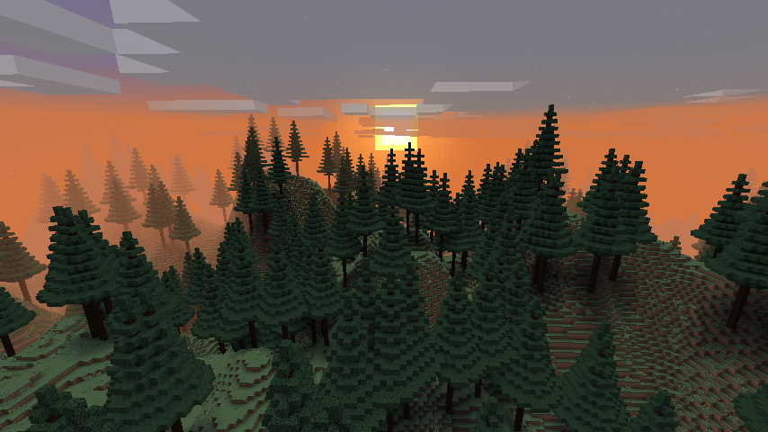
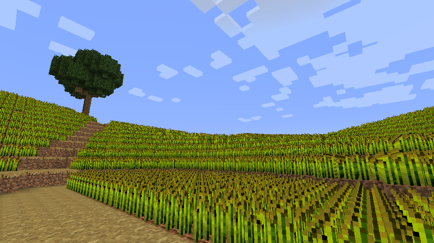

# terrain-command-only

使用方法：

1. 创建一个void预设世界，然后导入数据包
2. 重进存档并根据需要调整全局参数
3. 输入指令`/function terrain:start`开始生成世界

tips：

1. 使用`/function terrain:stop`暂停生成
2. 若想重新生成整个世界，请在所有已生成的位置运行`/function terrain:reset`，并删除所有区域文件；或者直接删除所有区域文件和`data/scoreboard.dat`文件
3. 使用`/function terrain:unload`卸载数据包

## FakePlayer

global计分项中可修改分数的虚拟玩家。

* radius：区块生成范围，采用曼哈顿距离
* unit：区块边长
* layer：分形叠加次数
* grid：初始晶格大小
* range：随机向量分量的范围，发生数值越界时可尝试降低该值
* height：平均高度
* variation：地形起伏程度

## 计分项

* global：记录全局变量
* math：存放数值常数以及一些临时变量
* state：区块的生成阶段，范围0-2
* pos_x：存放一些实体的x坐标
* pos_z：存放一些实体的z坐标
* count：区块像素填充计数器；区块方块生成计数器；地层层数计数器
* rand：随机数，用于随机现象或者一组实体的唯一标识
* depth：用于扫描半径内的区块，玩家所在区块深度等于生成半径，向四周递减；控制每个区块每帧最多生成16层方块
* layer：结点所在层级；区块当前叠加次数
* grid：区块当前晶格大小
* variation：区块当前起伏程度
* vector_x：结点随机向量x分量
* vector_z：结点随机向量z分量
* offset_x：像素在区块内的x偏移
* offset_z：像素在区块内的z偏移
* px：x分量乘积
* pz：z分量乘积
* a：点积，用于插值
* b：点积之差，用于插值
* interp_n：北面两结点插值结果
* interp_s：南面两结点插值结果
* interp：最终插值结果，单次叠加噪声值
* perlin：最终噪声值

## 配置相关

切换配置时，需要修改`tick.mcfunction`中的dispatch_generate目录和`perlin/noise.mcfunction`中的noise_modifier目录。

### default

推荐参数：
```
layer = 3
grid = 64
range = 32
height = 64
variation = 64
```



### cornfield

推荐参数：
```
layer = 3
grid = 96
range = 8
height = 16
variation = 24
```



---

> 核心的噪声运算模块于2019.5.23前完成，后因各种原因弃坑。</br>
> 原计划包含群岛、戈壁、颠倒世界、溶洞等配置，后由于1.16的出现决定将其移除。</br>
> 结构方块在主线程运行，容易造成卡顿。
